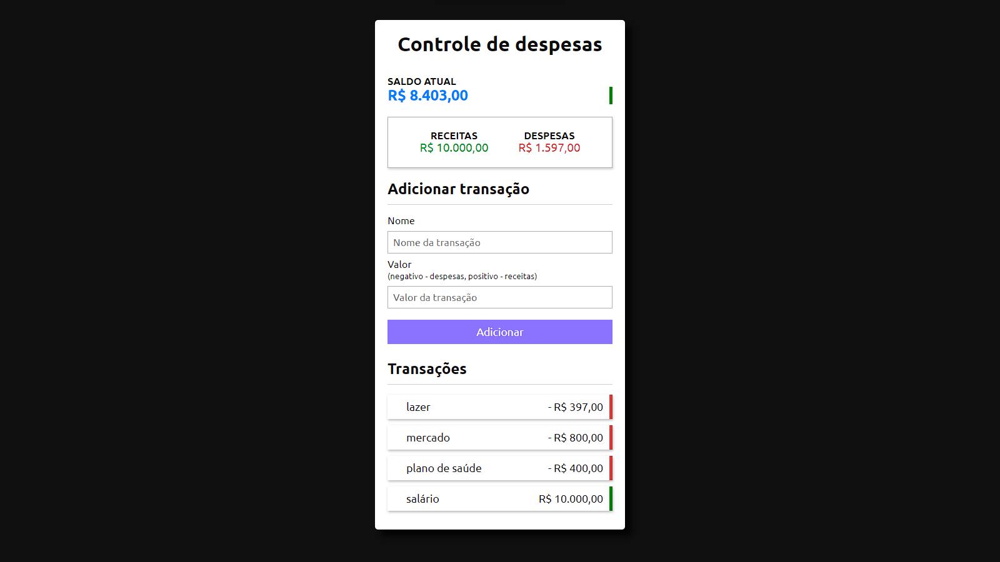

# Controle Financeiro

## 📱Descrição do projeto
### Se trata de uma aplicação web onde o usuário será capaz de adicionar suas receitas e despesas, o sistema faz o cálculo do total das despesas e receitas do usuário e, com base nesses números, calcula o seu saldo.
### Também é possível remover as transações feitas, e quando isso for feito, o sistema reajustará o cálculo do saldo, receitas e despesas.
### As informações a respeito das finanças ficam armazenadas no localStorage, isso significa que mesmo que o usuário saia da página ou recarregue a página, o programa continuará carregando as informações que esse usuário inseriu anteriormente.
### Os dados ficam armazenados em formato de objeto, com as propriedades: id, nome, valor.
### Quando uma transação é removida, o sistema reajusta os id's das outras transações, de modo que o primeiro id seja sempre 1 e os proxímos id's vão aumentando de 1 em 1.

## 🎯Proposta do projeto
### Desenvolvido para ajudar o usuário a ter um controle maior da sua vida financeira.

##  🔨Funcionalidades da aplicação web - RFs

- `Funcionalidade 1`: Adicionar Transações
- `Funcionalidade 2`: Remover Transações
- `Funcionalidade 3`: Consultar o Saldo, Receitas e Despesas
- `Funcionalidade 4`: somar as Receitas e as Despesas

## ✔️Tecnologias utilizadas
- `HTML`
- `CSS`
- `JavaScript`

## 
📱Interface 

## Interessado em testar o web app? Clique no link abaixo:
### 